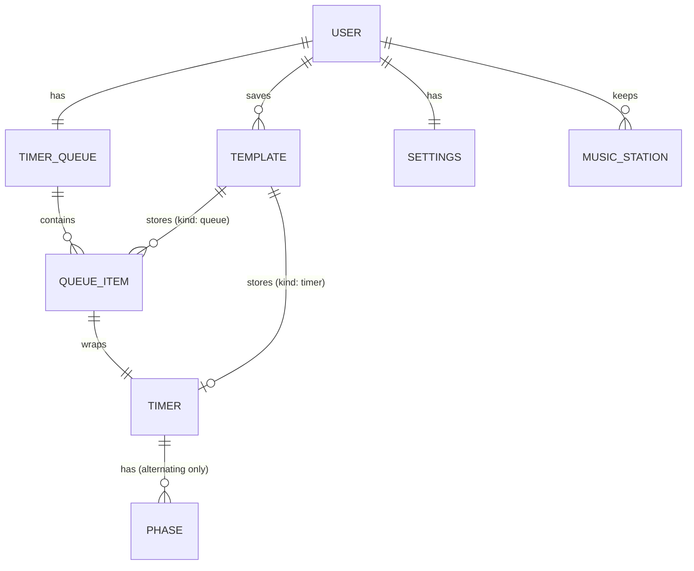

# Entity Map

Single-role, local-only app (static site on GitHub Pages). All data lives in the browser (LocalStorage) and can be exported to / imported from a JSON file.

## Diagram

## Entities

### User
**Description**: The single person using the app. Not a stored record, only the owner of all local data.
**Instances per user**: One
**Ownership**: User
**Lifecycle**: Implicit; data persists in the browser until cleared or replaced by an import.
**States**: n/a
**Contains**: Active TimerQueue, Settings, Templates, MusicStations

### Timer
**Description**: A countdown. Has two variants: `simple` (one duration, e.g. 10 min, built with DurationButtons) and `alternating` (a cycle of Phases, e.g. 25/5 or 5/10/15).
**Instances per user**: Many (one active at a time)
**Ownership**: User
**Lifecycle**: Created ad hoc or via a queue item or template; discarded when finished and not restarted, removed from the queue, or cleared.
**States**: `idle → running ⇄ paused → finished`; `finished → running` via restart; `running/paused → idle` via reset or stop.
**Contains**: Phases (alternating only); `cycles` (a number or infinite) for alternating timers
**Belongs to**: QueueItem or Template (optional)

### Phase
**Description**: One segment of an alternating timer, with its own duration (e.g. the 25 min work phase).
**Instances per user**: Many per alternating Timer
**Ownership**: User
**Lifecycle**: Lives and dies with its parent Timer.
**States**: pending → active → done (within a cycle)
**Belongs to**: Timer (alternating)

### QueueItem
**Description**: A named Timer placed in the queue (e.g. "Plan tasks", 10 min). Can wrap a simple or an alternating timer.
**Instances per user**: Many
**Ownership**: User
**Lifecycle**: Created by adding a timer, loading a template, or duplicating an item; removed individually or by clearing the queue.
**States**: queued → running → finished (follows its Timer)
**Contains**: One Timer, a name
**Belongs to**: TimerQueue

### TimerQueue
**Description**: The ordered list of QueueItems that run one after another. Has an `autoAdvance` toggle: when on, the next item starts by itself; when off, it waits for a click.
**Instances per user**: One (the current queue)
**Ownership**: User
**Lifecycle**: Always exists; may be empty. Persisted locally. Emptied with "Clear queue".
**States**: empty → ready → running ⇄ paused → finished
**Contains**: QueueItems

### Template
**Description**: A named saved timer or whole queue (TimerSet), reusable with one click. Kept in a flat list (no folders or tags). Loading a template appends its items to the end of the current queue.
**Instances per user**: Many
**Ownership**: User
**Lifecycle**: Created by saving a timer or the current queue; lives until deleted.
**States**: n/a
**Contains**: One Timer (kind `timer`) or a list of QueueItems (kind `queue`)

### MusicStation
**Description**: A background music stream, independent of the timer. Either built-in (Chillhop, Lofi Girl) or a custom YouTube link the user pasted. Can be marked as favorite.
**Instances per user**: Many
**Ownership**: System (built-in) / User (custom)
**Lifecycle**: Built-ins always exist; custom stations live until removed.
**States**: stopped ⇄ playing
**Belongs to**: User

### Settings
**Description**: Global preferences: alarm sound, alarm volume, repeat-until-dismissed, theme (light/dark), browser notification permission state, default `autoAdvance`.
**Instances per user**: One
**Ownership**: User
**Lifecycle**: Always exists with defaults; persisted locally; included in JSON export.
**States**: n/a

## Additions from proto-detail

### ActiveRun
**Description**: The currently running (or paused/finished) timer. Exactly one at a time, either ad hoc from the stage or started from a queue item. Holds the timer definition, the current phase and cycle, and an end timestamp used to compute remaining time. Persisted so a reload keeps the run.
**Instances per user**: One
**Ownership**: System
**Lifecycle**: Created on Start, destroyed on Stop/Done.
**States**: `idle → running ⇄ paused → finished`
**Belongs to**: timer-engine
