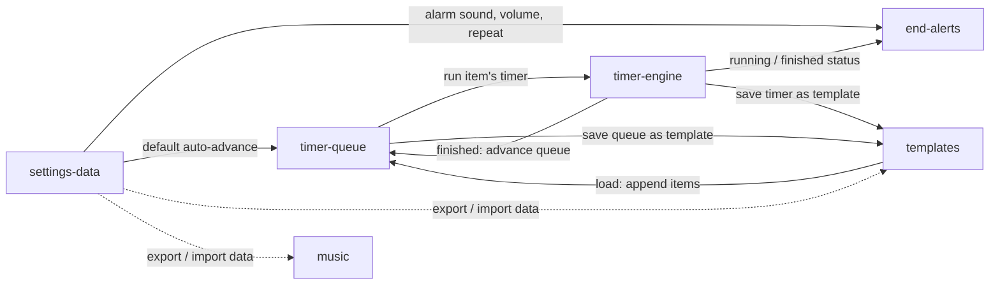

# Module Breakdown

## Overview
Dopatime is a single-page, local-only timer app. It breaks down into six design modules: three core modules that solve the main problem (run a focus timer, never miss its end, chain timers into a queue), two supporting modules (templates, background music) and one generic module (settings and JSON data transfer).

## Modules

### timer-engine
**Type**: Core
**Description**: The heart of the app: building a duration and running a countdown. Covers simple timers built from additive DurationButtons and alternating timers made of phases with a cycle count, plus the full run controls and the main countdown view.
**Entities**: Timer, Phase (TimerStatus)
**Key Actions**: Build simple timer, Define alternating timer, Start, Pause, Resume, Reset, Skip, Add 1 minute, Stop, Restart
**Connects to**: timer-queue (a queue item runs a timer; a finished timer advances the queue), end-alerts (status changes trigger alerts and tab title updates), templates ("Save timer as template")
**Design priority**: High — every other module depends on it, and the additive-button duration builder is the main interaction.

---

### end-alerts
**Type**: Core
**Description**: Makes sure the user never misses a timer. Shows the countdown in the browser tab title while running, and on finish fires sound, browser notification and tab title change together, optionally repeating until dismissed.
**Entities**: EndAlert, TabTitleCountdown
**Key Actions**: Update tab title, Trigger alert, Request notification permission, Dismiss alert
**Connects to**: timer-engine (reacts to `running` and `finished` status), settings-data (alarm sound, volume, repeat-until-dismissed)
**Design priority**: High — it answers the main user problem ("don't let me miss it"); has browser-specific risks (background tab throttling, notification permission, audio autoplay rules).

---

### timer-queue
**Type**: Core
**Description**: An ordered list of named timers that run one after another, with an `autoAdvance` toggle (next item starts by itself, or waits for a click). Items can be simple or alternating timers.
**Entities**: TimerQueue, QueueItem
**Key Actions**: Add item to queue, Edit item, Remove item, Duplicate item, Reorder items, Clear queue, Start queue, Toggle auto-advance, Start next item
**Connects to**: timer-engine (runs each item's timer, advances on finish), templates (loading a template appends items; "Save queue as template"), settings-data (default auto-advance)
**Design priority**: High — most complex structure (queue → item → phases → cycles) to fit on one page without clutter.

---

### templates
**Type**: Supporting
**Description**: Saved favorite timers and sets of timers (queues), kept in a flat list. Loading a template appends its items to the end of the current queue.
**Entities**: Template (TimerSet)
**Key Actions**: Save timer as template, Save queue as template, Load template, Rename template, Delete template
**Connects to**: timer-queue (load appends items; save from queue), timer-engine (save a single timer), settings-data (included in JSON export/import)
**Design priority**: Medium — straightforward list management once queue and engine exist.

---

### music
**Type**: Supporting
**Description**: Background music, independent of the timer. Built-in stations (Chillhop, Lofi Girl), custom YouTube links and favorites, with play/pause and volume.
**Entities**: MusicStation
**Key Actions**: Select station, Play / Pause, Change volume, Add custom station, Remove custom station, Mark / unmark favorite
**Connects to**: settings-data (custom stations and favorites included in JSON export/import)
**Design priority**: Medium — independent of the other modules; the open question is how to embed YouTube streams (iframe vs. link).

---

### settings-data
**Type**: Generic
**Description**: Global preferences and data portability. Alarm sound and volume, repeat-until-dismissed, theme, default auto-advance, and JSON export/import of everything stored locally.
**Entities**: Settings
**Key Actions**: Choose alarm sound, Change alarm volume, Toggle repeat until dismissed, Switch theme, Set default auto-advance, Export JSON, Import JSON
**Connects to**: end-alerts (alarm preferences), timer-queue (default auto-advance), templates and music (data in export/import)
**Design priority**: Low — standard patterns; open question is whether import replaces or merges existing data.

---

## Integration Map

## Prototyping Order

1. **timer-engine** — everything else depends on it, and it holds the main interaction (additive duration buttons).
2. **end-alerts** — without reliable alerts the timer doesn't solve the user's core problem.
3. **timer-queue** — the biggest differentiator from ordinary timers; builds directly on the engine.
4. **templates** — needs queue and engine to save from and load into.
5. **music** — independent, can be designed after the core flow works.
6. **settings-data** — generic; collects preferences and data from all other modules.

## Priority Areas

- **Duration building with additive buttons (timer-engine)**: The most frequent interaction. It has to be faster than typing numbers, and needs a clear way to see and undo what was added.
- **Queue with nested alternating timers (timer-queue)**: Queue → item → phases → cycles is a deep structure that must stay readable on a single page.
- **Reliable end-of-timer alerts (end-alerts)**: Background tabs throttle timers, so the countdown must be computed from timestamps rather than ticks; notification permission and audio autoplay rules need graceful fallbacks.
